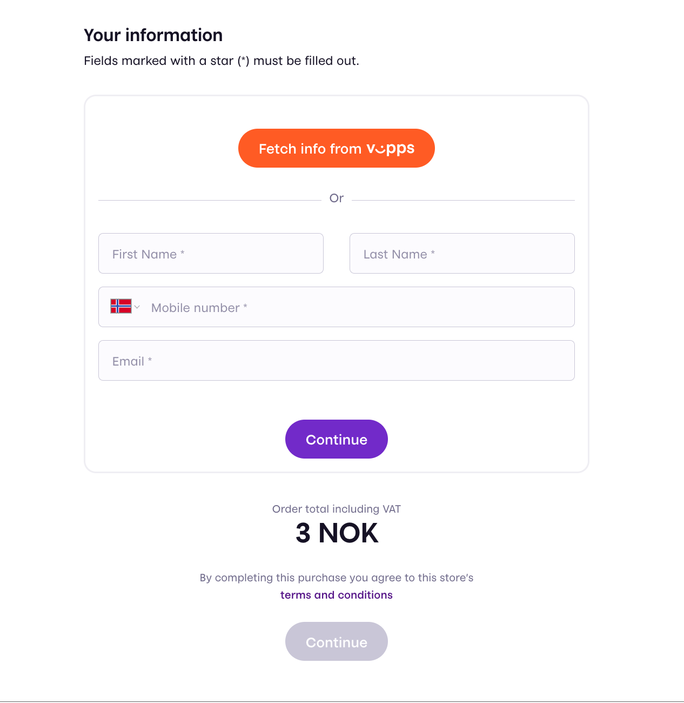
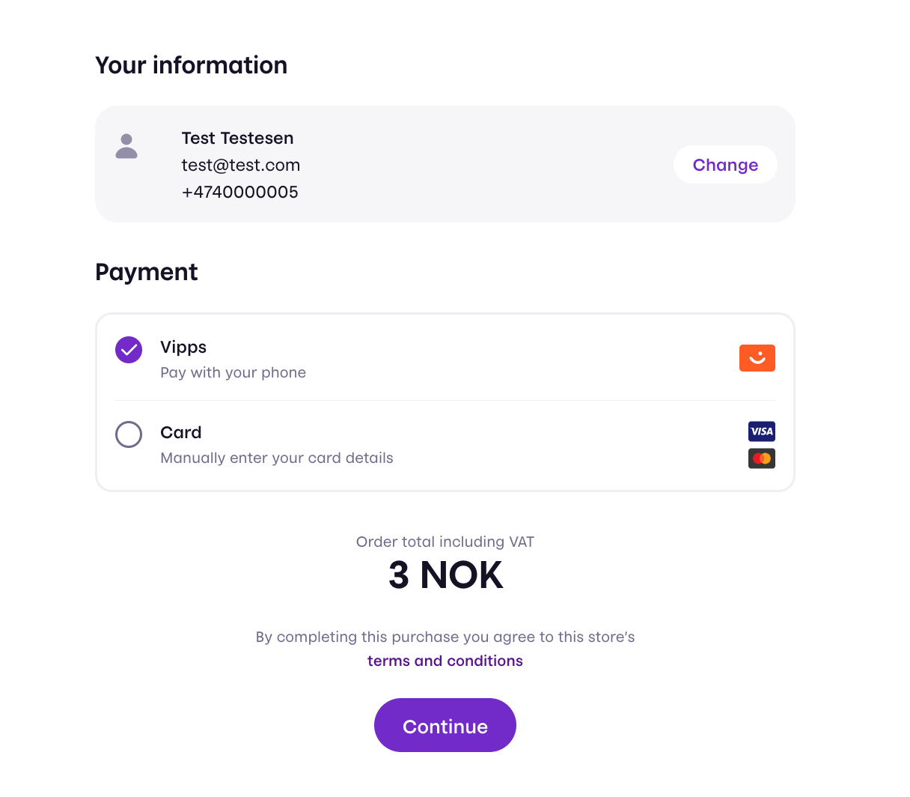
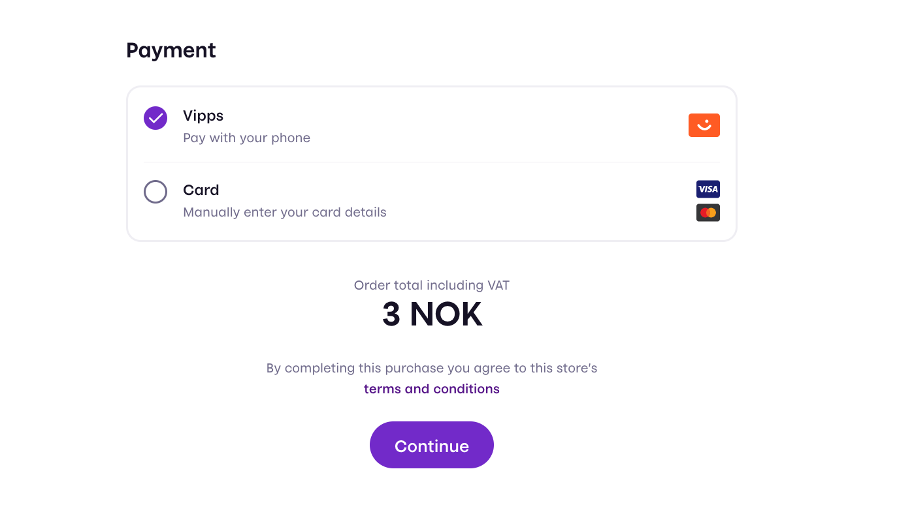
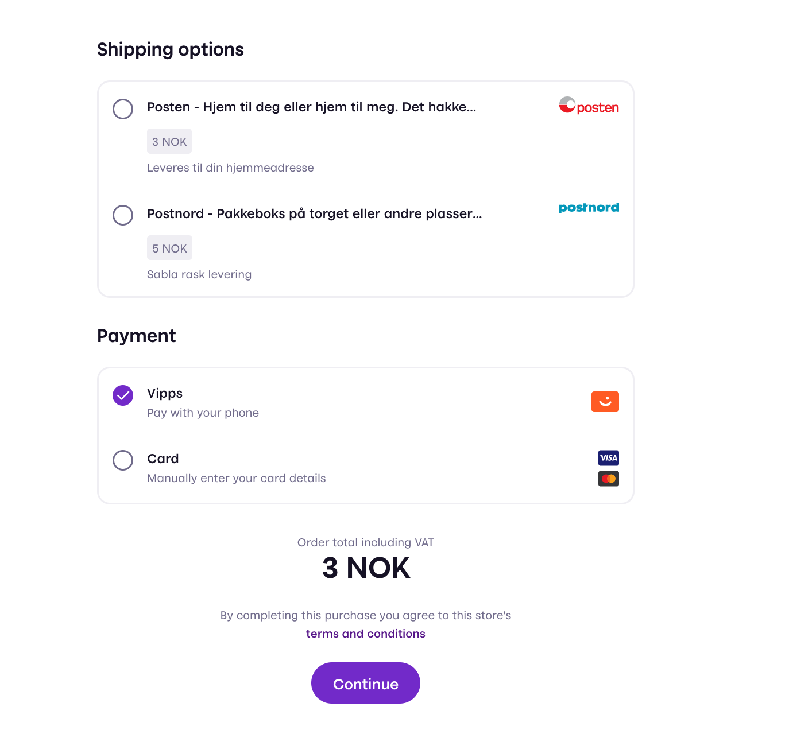
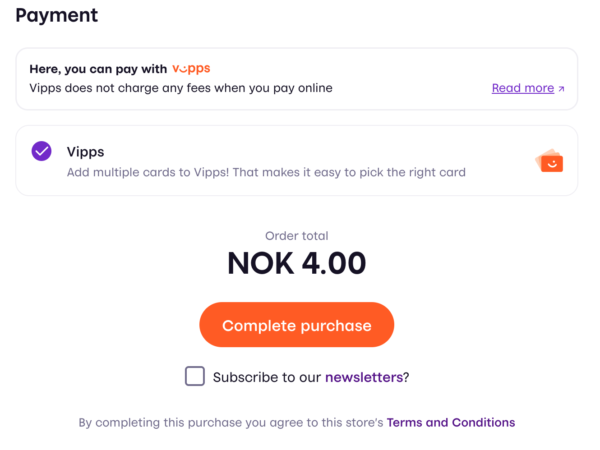
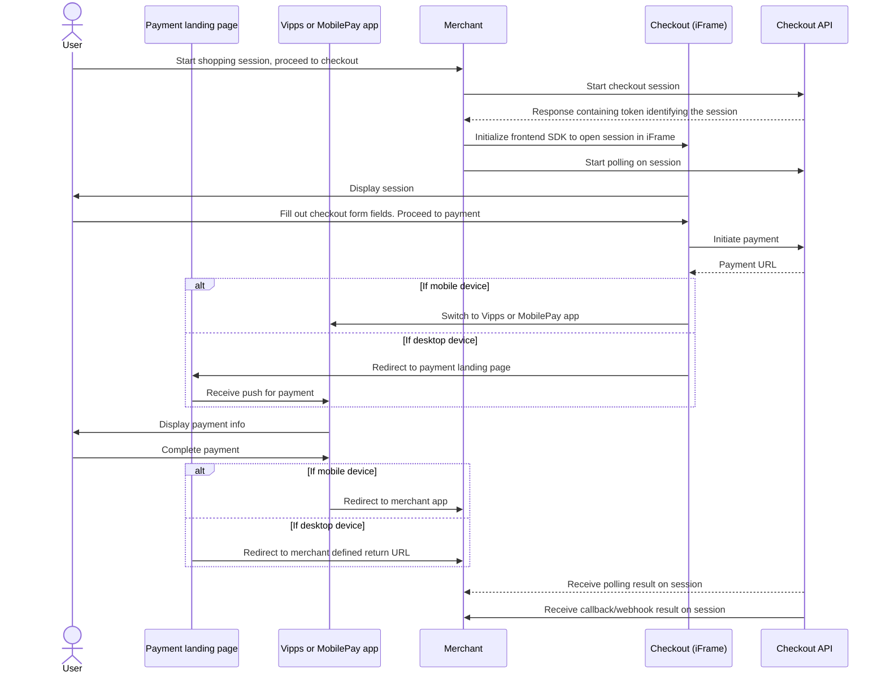

<!-- START_METADATA
---
title: Checkout API guide
sidebar_label: API guide
sidebar_position: 10
description: Find technical details about integrating with the Checkout API.
pagination_prev: Null
pagination_next: Null
---
END_METADATA -->

# API guide

 *Available for Vipps now.*

 *Available for MobilePay in selected markets at the [Vipps MobilePay joint platform launch](https://www.vippsmobilepay.com/about).*

<!-- START_COMMENT -->
ℹ️ Please use the website:
[Vipps MobilePay Technical Documentation](https://developer.vippsmobilepay.com/docs/APIs/checkout-api>).
<!-- END_COMMENT -->

The Checkout API provides an all-in-one solution for receiving payment for goods and services online using our trusted technology and brand.
It combines the Vipps MobilePay products,
[Login](https://developer.vippsmobilepay.com/docs/APIs/login-api/)
and [ePayment](https://developer.vippsmobilepay.com/docs/APIs/epayment-api/), allowing a frictionless integration for merchants.

API version: 3.0.0.

**Please note:** Always use the most recent API version when integrating with *Checkout*. All endpoints are described in detail in our [API Reference](https://developer.vippsmobilepay.com/api/checkout).

**Migrating to V3?** Consult our [Migration Guide](checkout-api-migration-v3.md).


## Checkout Features

Explains the high level features of *Checkout*.

### Checkout API

*Checkout* works around the concept of a *session*, which has a time to live of one hour. The API exposes endpoints for the merchant to interact with a session. These include:

* session initiation
* session status

### Checkout frontend

Once a session is created, it is to be opened inside an iFrame embedded on the merchant website. The iFrame loads a web application that fetches all necessary information about the session from Vipps MobilePay.

#### Frontend SDK

We provide a frontend SDK to make opening the session on the merchant easy
(the SDK is
[explained in detail](#step-2-displaying-the-session)
later in this guide).

It is **strongly** recommended using the frontend SDK.
If you do not use the SDK your implementation will require far more coding,
and you will not get improvements and bug fixes we do in the SDK.

### Shipping

In most situations a merchant wants to send goods to a customer using a shipping provider. Consult [the shipping guide](https://developer.vippsmobilepay.com/docs/APIs/checkout-api/checkout-how-it-works-shipping) and the [API spec](https://developer.vippsmobilepay.com/api/checkout#tag/Session/paths/~1session/post) for a detailed description of which shipping providers and features *Checkout* support.

### Checkout Direct

With *Checkout Direct* you can easily implement an express checkout experience directly from a single product without going through a shopping cart. *Checkout Direct*  decouples you from needing to embed the iFrame and lets us handle everything at `checkout.vipps.no` before returning the customer to your shop after a payment is finished. To use *Checkout Direct* , follow the [System integration guidelines](#system-integration-guidelines) and make sure you pick [Alternative 2](#alternative-2-checkout-direct---we-handle-the-checkout-and-redirect-the-user-back-to-you) under [Step 2: Displaying the session to the user](#step-2-displaying-the-session).

### Checkout Elements

With *Checkout Elements*, you can adjust the fields and values present in the *Checkout*. For example, you might have a purchasing flow where you do not require an address because you are not sending physical goods, or you do not need the customers to identify themselves because they are already logged into your system.

The `Elements` mode is set by `configuration.Elements` in initiate session.

### `PaymentAndContactInfo` example

If you do not need the address from a user you can disable it using Elements set to `PaymentAndContactInfo`, resulting in the following personal details form.



And the following payment form



### `PaymentOnly` example

If you do not need the contact details for a customer you can disable it using Elements `PaymentOnly`, resulting in the following session



#### Combination with shipping

These options may be combined with shipping if it fits your scenario. For example resulting in the following session:



### Remembering of customer data

*Checkout* supports easy fetching of user info with the built-in *Login* integration. With a functionality called "Remember Me", the user is can opt in to having this information being persisted across different *Checkout* sessions on the same machine.

### Prefill customer data

We believe that simplicity is key to providing the best user experience. With `prefillCustomer`, you can easily send in any information you have about your customer, making filling out forms in the Checkout a breeze.
All fields in `prefillCustomer` are optional. We will prefill the form with whatever information you send and let your customers fill in the rest if any information is missing.

To further streamline the payment process, we've implemented a feature that automatically forwards the phone number to our [landing page](https://developer.vippsmobilepay.com/docs/knowledge-base/landing-page/).
This removes the hassle of having to fill in the phone number multiple times and makes it even easier for your customers to pay.

Even if your Checkout is set up with `PaymentOnly`, you can still send in your customer's phone number to make the payment process smoother.

### Custom consent

Sometimes you need to ask your customers for permission for certain actions, such as subscribing to newsletters. That's where our "custom consent" feature comes in handy!

When you enable "custom consent", a checkbox with a message appears at the bottom of the checkout page. Your customers can choose to check this box if they want to give their consent. You can make the checkbox optional or required, depending on your needs.

The message displayed next to the checkbox can contain up to one link, formatted in Markdown like this: `[linkText](https://example.com)`. This allows you to direct customers to additional information or resources related to the consent request.



### Receipts

*Checkout* **(V3 only)** supports creating receipts, visible in the App. This can be useful in many cases, and a receipt can be mandatory in some cases [as described below](#receipts-and-assisted-content-monitoring). It is possible to post the order lines and bottom line to the Order Management API independently, without using the functionality described in this section. Then you need to use [The Order Management API](https://developer.vippsmobilepay.com/docs/APIs/order-management-api/order-management-api-guide/#receipts) directly.

To enable Checkout to create receipts, the `OrderSummary` property in the session initiation must be set. Detailed information is available in the OpenAPI spec [session initiation endpoint][create-checkout-session-endpoint]

Receipt information is a combination of a list of *OrderLines* and a *BottomLine*. An *OrderLine* is a description of each item present in the order. The *BottomLine* contains information regarding the order as a whole.
It is possible to specify shipping costs in one or more *OrderLines* in the session initiation.
If shipping is handled in Checkout and is not free, an order line with the shipping cost will be automatically added, **even if** shipping costs are specified in the session initiation.

If set up properly in the `OrderSummary` property in the session initiation, the receipt will be created when payment is initiated (by sending it to Order Management API), and will be visible in the customer's app when the payment is successfully completed.
Further details regarding receipts in [The Order Management API](https://developer.vippsmobilepay.com/docs/APIs/order-management-api/order-management-api-guide/#receipts)

#### Show order summary

In addition to automatically creating [receipts](https://developer.vippsmobilepay.com/docs/APIs/order-management-api/order-management-api-guide/#receipts), setting up the `OrderSummary` property as described above enables the use of `showOrderSummary: true` inside `configuration` in the session initiation. This will display a simplified order summary, similar to the receipt, on top of the Checkout window. Use this feature if you would like to show what the user is paying for during the checkout. We show a simpler summary than the receipt using a subset of the properties inside `OrderSummary`. E.g. tax calculations are shown in the receipt, but not in the order summary. The following properties will be honored `id, name, discount, giftcard, totalAmount, productUrl, isReturn, isShipping, currency, giftCardAmount, quantity`


#### Receipts and Assisted Content Monitoring

We offer [assisted content monitoring](https://developer.vippsmobilepay.com/docs/APIs/order-management-api/order-management-api-guide/#vipps-assisted-content-monitoring) as a way for Merchants to deal with the regulatory demands of content monitoring.
For some merchants, we can utilize the merchant's webpage for content monitoring, continuously verifying that the actual products being sold coincides with the expected products.
If you, as a merchant, do not have a permanent website that can be utilized for content monitoring, for example you do not have a user facing website or the website is ephemeral/short-lived, then you must utilize Assisted Content Monitoring.
In order to comply with Assisted Content Monitoring, all transactions must be posted to the Order Management receipts functionality described in this section.

## System integration guidelines

Be sure to always use the most updated version of the API when integrating.

See also: [quick start guide](checkout-api-quick-start.md).

### Flow diagram

The standard flow for a Checkout consists of

1. Initiating a session
2. Displaying the session to the user
3. Handling the result of the session



### Step 1: Initiating a session

The merchant backend calls the [session initiation endpoint][create-checkout-session-endpoint]

```http
POST: https://api.vipps.no/checkout/v3/session
```

with headers

| Header                        | Description                                                                           | Example value          |
| ----------------------------- | ------------------------------------------------------------------------------------- | ---------------------- |
| `Merchant-Serial-Number`      | Unique number for a merchant. Found in the [merchant portal](https://portal.vipps.no) | `123456`               |
| `Client_Id`                   | Client ID. Found in the [merchant portal](https://portal.vipps.no)                    | `fb492b5e-7907-4d83-bc20-c7fb60ca35de` |
| `Client_Secret`               | Client Secret. Found in the [merchant portal](https://portal.vipps.no)                | `Y8Kteew6GE2ZmeycEt6egg=` |
| `Ocp-Apim-Subscription-Key`   | Subscription key. Found in the [merchant portal](https://portal.vipps.no)             | `0f14ebcab0ec4b29ae0cb90d91b4a84a` |
| `Vipps-System-Name`           | The name of the ecommerce solution                                                    | `woocommerce`          |
| `Vipps-System-Version`        | The version number of the ecommerce solution                                          | `5.4`                  |
| `Vipps-System-Plugin-Name`    | The name of the ecommerce plugin                                                      | `woocommerce-checkout` |
| `Vipps-System-Plugin-Version` | The version number of the ecommerce plugin                                            | `1.4.1`                |

The last four headers (starting with `Vipps-System-`) are meant to identify your system (and plugin). Please use self-explanatory, human-readable and reasonably short values.
See [API keys](https://developer.vippsmobilepay.com/docs/knowledge-base/api-keys/#how-to-use-the-api-keys) and [HTTP Headers](https://developer.vippsmobilepay.com/docs/knowledge-base/http-headers/) for more information.

All fields of the request body are described in our [API Reference][create-checkout-session-endpoint].

The response object consists of a `token` and a `checkoutFrontendUrl`, which are used in the next step

#### Configuration for use inside a native mobile application

Checkout can be used in an iOS or Android app to pay for goods and services. The Checkout frontend may then be opened directly inside a web view, instead of as an iFrame inside a merchant website.

In this situation, the merchant may wish to have a `returnUrl` to direct the user back to an application using a custom URL scheme (e.g. `myapp://`) instead of HTTPS. The frontend application will automatically try to detect if the user is on a mobile device, if so doing an "app switch" into the Vipps or MobilePay app, and then back to your application upon completion. Because of variations in devices and browser implementations there are certain edge cases where the device type is wrongly detected. Initiate the session with `userFlow` set to `NATIVE_REDIRECT` to ensure that the app switching is done consistently after payment.

### Step 2: Displaying the session

Load the frontend SDK in the `<head>` section of the merchant website.

```html
<head>
  <script src="https://checkout.vipps.no/vippsCheckoutSDK.js"></script>
</head>
```

#### Alternative 1: Classic implementation where Checkout is embedded in an iFrame on your site

This is the standard flow where *Checkout* is embedded on your site typically when a customer checks out a shopping cart. For direct checkout of a single item, see [Checkout Direct](#alternative-2-checkout-direct---we-handle-the-checkout-and-redirect-the-user-back-to-you). The two alternatives can work side by side in combination on your site.

The frontend SDK exposes a global function called `VippsCheckout`. Initialize this with the following parameters:

| Parameter             | Description                                                                                                       | Optional |
| --------------------- | ----------------------------------------------------------------------------------------------------------------- | -------- |
| `checkoutFrontendUrl` | Specifies where to load the iFrame content from. Comes from session creation response                             | No       |
| `iFrameContainerId`   | The ID of the HTML element to contain the Checkout iFrame                                                         | No       |
| `token`               | Token identifying the session. Comes from session creation response.                                              | No       |
| `language`            | Can be set to 'no' Norwegian, or 'en' English. This is optional and will default to 'en' English if not specified | Yes      |
| `on`                  | Listen to events from Checkout. See [SDK events](#frontend-sdk-events) for more details.                                   | Yes      |

Example merchant website using *Checkout* frontend SDK to embed an iFrame with the session in plain html/js.

**Please note:** To call the “create session endpoint” you must include headers that contain secret keys (client secret, subscription key). The JavaScript in the example can be openly viewed by anyone as it is client side frontend code. Therefore, you must call your own backend from the JavaScript on the frontend, and then in that backend call the Checkout create session endpoint, so you don’t leak the keys.

```html
<html>
  <head>
    <title>Merchant website</title>
    <script src="https://checkout.vipps.no/vippsCheckoutSDK.js"></script>
  </head>
  <body>
    <button type="button" id="checkout-button">Checkout with Vipps</button>
    <section id="vipps-checkout-frame-container">
      <!-- This is where the iFrame will be embedded -->
    </section>
    <script>
      document
        .getElementById("checkout-button")
        .addEventListener("click", function () {
          // Relay an initiate session request to Checkout API through the merchant's backend
          fetch("<MERCHANT BACKEND CREATE SESSION URL>", {
            method: "POST",
          })
            .then((response) => response.json())
            .then((data) => {
              var vippsCheckout = VippsCheckout({
                checkoutFrontendUrl: data.checkoutFrontendUrl,
                iFrameContainerId: "vipps-checkout-frame-container",
                language: "no",
                token: data.token,
              });
            })
            .catch((error) => {
              // Handle at least these two types of errors here:
              // 1. Fetch to create session endpoint failed
              // 2. Checkout frontend SDK not loaded resulting in VippsCheckout not being defined
            });
        });
    </script>
  </body>
</html>
```

**Please note:** The Checkout frontend **is not** supposed to be open in its own browser window/tab. The only exception to this is when using Checkout inside a web view in a native mobile application.

#### Sticky checkout session

The frontend SDK provides an alternative way to display the session, using a query parameter in the URL. This makes the session "sticky", meaning that the same session will open after a page refresh.

If the query parameter `token` is present and the token attribute in the argument object to `VippsCheckout` **is not** defined, the frontend SDK will load the iFrame with the token from the query parameter.

A helper method, when called, will redirect to the current page with the `token` query parameter added to the URL. Initialize the `VippsCheckout` function outside initiating a session.

**Please note:** Make sure to initialize `VippsCheckout` outside any user dependent execution blocks (like event handlers) to make sure that the iFrame is loaded every time a user lands on the page.

```js
// Globally defined
var vippsCheckout = VippsCheckout({
  checkoutFrontendUrl: data.checkoutFrontendUrl,
  iFrameContainerId: 'checkout-iframe-container',
});

// Create session fetch function
.then((data) => {
  vippsCheckout.redirectToCurrentPageWithToken(data.token)
})
```

#### Frontend SDK events

You can listen to changes in Checkout by supplying callbacks to the `on` option in the frontend SDK.
Each key in the map supplied to `on` corresponds to an event and accepts a call callback-function with a `data` parameter as a value.

Available events:

| Parameter                      | Description                                                                                             | Type                                                                                                                                            |
| ------------------------------ | ------------------------------------------------------------------------------------------------------- | ----------------------------------------------------------------------------------------------------------------------------------------------- |
| `shipping_option_selected`     | Is triggered when the user selects a shipping option or `undefined` when shipping option is deselected. | `ShippingOption` &#124; `undefined`                                                                                                             |
| `total_amount_changed`         | Is triggered when the total amount changes (for example, when a shipping option is selected).            | `Money`                                                                                                                                         |
| `session_status_changed`       | Is triggered upon changes in session status (for example, when payment is started).                   | `SessionStarted` &#124; `PaymentInitiated` &#124; `PaymentSuccessful` &#124; `PaymentFailed` &#124; `SessionTerminated` &#124; `SessionExpired` |
| `shipping_address_changed`     | Is triggered when a new "delivered to" address is submitted or `undefined` when removed.                | `Address` &#124; `undefined`                                                                                                                    |
| `customer_information_changed` | Is triggered when new customer information is submitted or `undefined` when removed.                    | `Address` &#124; `undefined`                                                                                                                    |

##### Types

###### `ShippingOption`

| Parameter     | Type                             | Description                                                                 |
| ------------- | -------------------------------- | --------------------------------------------------------------------------- |
| `id`          | `string`                         | The merchants shipping option identification.                               |
| `brand`       | `string`                         | The name of the brand of the option (for example, "Posten" or "PostNord").   |
| `description` | `description` &#124; `undefined` | The description of the shipping option.                                     |
| `product`     | `string`                         | The brand specific product (for example, "Servicepakke" or "Home delivery"). |
| `price`       | `Money`                          | The price of the shipping option.                                           |

###### `Money`

| Parameter                | Type     | Description                                                                                                 |
| ------------------------ | -------- | ----------------------------------------------------------------------------------------------------------- |
| `fractionalDenomination` | `number` | Value of in minor units. For Norwegian kroner (NOK) that means 1 kr = 100 øre. Example: 499 kr = 49900 øre. |
| `currency`               | `string` | Three letter ISO-4217 currency code.                                                                        |

###### `Address`

| Parameter   | Type     |
| ----------- | -------- |
| `address`   | `string` |
| `city`      | `string` |
| `country`   | `string` |
| `email`     | `string` |
| `firstName` | `string` |
| `lastName`  | `string` |
| `phone`     | `string` |
| `zip`       | `string` |

##### Example

```js
window.VippsCheckout = {
  checkoutFrontendUrl: data.checkoutFrontendUrl,
  iFrameContainerId: "vipps-checkout-frame-container",
  language: "no",
  token: data.token,
  on: {
    shipping_option_selected: function (data) {
      // Do something when the shipping option is selected
    },
    total_amount_changed: function (data) {
      // Do something when the total amount changed
    },
    session_status_changed: function (data) {
      // Do something when status changed
    },
    shipping_address_changed: function (data) {
      // Do something when shipping address changed
    },
    customer_information_changed: function (data) {
      // Do something when customer information changed
    },
  },
};
```

#### Alternative 2: Checkout Direct - we handle the checkout and redirect the user back to you

To check out a single item directly, use *Checkout Direct*. Hook this flow up on a button directly on a product, and we handle the rest by redirecting the user to `checkout.vipps.no` where we handle the checkout. We will return the customer back to your site when finished.

We also have a [Checkout button](https://developer.vippsmobilepay.com/docs/design-guidelines/checkout-button/) with our look-and-feel that you can use (if you so choose) to make the integration super easy on your product page!

The frontend SDK exposes a global function called `VippsCheckoutDirect`. Initialize this with the following parameters

| Parameter             | Description                                                                                                       | Optional |
| --------------------- | ----------------------------------------------------------------------------------------------------------------- | -------- |
| `checkoutFrontendUrl` | Specifies where to load the iFrame content from. Comes from session creation response                             | No       |
| `token`               | Token identifying the session. Comes from session creation response.                                              | No       |
| `language`            | Can be set to 'no' Norwegian, or 'en' English. This is optional and will default to 'en' English if not specified | Yes      |

**Please note:** To call the [session creation endpoint][create-checkout-session-endpoint], you must include headers that contain secret keys (client secret, subscription key). The JavaScript in the example can be openly viewed by anyone as it is client-side frontend code. Therefore, you must call your own backend from the JavaScript on the frontend, and then in that backend, call the Checkout create session endpoint, so you don't leak the keys.

```html
<html>
  <head>
    <title>Merchant website</title>
    <script async type="text/javascript" src="https://checkout.vipps.no/vippsCheckoutSDK.js"></script>
    <script async type="text/javascript" src="https://checkout.vipps.no/checkout-button/v1/vipps-checkout-button.js"></script>
  </head>
  <body>
    <vipps-checkout-button id="checkout-button" variant="orange" branded="true"></vipps-checkout-button>
    <script>
      document
        .getElementById("checkout-button")
        .addEventListener("click", function () {
          // Relay an initiate session request to Checkout API through the merchant's backend
          fetch("<MERCHANT BACKEND CREATE SESSION URL>", {
            method: "POST",
          })
            .then((response) => response.json())
            .then((data) => {
              VippsCheckoutDirect({
                checkoutFrontendUrl: data.checkoutFrontendUrl,
                language: "no",
                token: data.token,
              });
            })
            .catch((error) => {
              // Handle at least these two types of errors here:
              // 1. Fetch to create session endpoint failed
              // 2. Checkout frontend SDK not loaded resulting in VippsCheckout not being defined
            });
        });
    </script>
  </body>
</html>
```

**Please note:** The `VippsCheckoutDirect` method in the frontend SDK can be used instead of `VippsCheckout` as per alternative 1, if you want to bypass the iFrame flow and let us handle the checkout completely.

### Step 3: Handling the result of the session

After the user has completed the checkout process, the merchant will be notified with transaction details through *callback* and *polling*, as described below.

**Please note:** It is highly recommended implementing polling in addition to callback. We **do not** guarantee delivery of the callback.

#### Callback Handling

The callback will be sent to a
[callback endpoint (click on the "Callbacks" tab)][create-checkout-session-endpoint]
implemented by the merchant.

```http
POST: {merchantInfo.callbackUrl}
```

The `callbackAuthorizationToken`, provided by the merchant at session initiation, will be attached as the `Authorization` header. Use this to authorize the caller.

Every callback must be answered with a `HTTP 2XX response`. In the eventuality that any other response is sent, we will retry with an exponential backoff until `2XX` is received again. The callback will be retried a maximum of 3 times.
Please keep in mind that we **do not** guarantee delivery of the callback, so it is highly recommended implementing polling in addition to callback.

It is critical that the endpoint receiving the callback is robust. It should also be able to receive any additional data not specified in the minimum example, so that it can be backwards compatible in accordance with our integration guidelines.

#### Session polling

Checkout will expose a [polling endpoint][retrieve-sessioninfo-endpoint].

The complete URL for polling is returned from the
[session creation endpoint][create-checkout-session-endpoint]
as `pollingUrl`.

#### Determine status of payment

The status of the payment can be `CREATED`, `AUTHORIZED`, or `TERMINATED`. It can be found inside the `PaymentDetails` object in both the callback or session polling response.

Note that a callback will never be in the `CREATED` state, as it is only sent after a payment is completed in an end state. For example, when a customer successfully pays, the `PaymentDetails.state` is `AUTHORIZED`. If the payment is initiated and ongoing, it will be `CREATED`. If the payment was either aborted, expired, or an error occurred, the state is `TERMINATED`. Please refer to the [OpenAPI schema][retrieve-sessioninfo-endpoint] for `CallbackSessionDetails` and `GetSessionResponse` to see the whole context.

If you want more details about the payment, call the [underlying get payment endpoint][get-payment-endpoint] that Checkout itself uses.

### Step 3a: If a transaction is authorized, capture payment

If the payment state of a session is `AUTHORIZED`, when received in callback or polling, the amount of the transaction was successfully *reserved*.

In order to actually move the money and complete the payment, the transaction must be *captured*. Capture must be done in accordance with the terms and conditions you have with the user. Our recommendation is that this is not performed until the goods or services have been delivered.

A capture operation for the whole reserved amount is called a *full capture*.
A capture operation for only part of the reserved amount is called a *partial capture*.

A *partial capture* is used, for example, if only parts of an order could be fulfilled.

For more details about full and partial capture, see the ePayment API schema: [`POST:/epayment/v1/{reference}/capture`][capture-payment-endpoint].

**Please note:** You cannot perform a capture on an amount larger than that which is reserved.

**Please note:** A reservation will expire automatically after some days if it is not captured, but it can also be manually removed using the `Cancel` transaction operation. If a transaction is already captured, the `Refund` operation must be used. This is because money has actually been moved at this point and must be moved back. See
[Transaction operations](./checkout-api-guide.md#transaction-operations-capture-cancel-refund-details) for more information.

## Integration partner and plugin guidelines

*Checkout* allows you to use [partner keys](https://developer.vippsmobilepay.com/docs/partner/partner-keys) for authentication.

In the initiation request, use your own partner keys and send the Merchant Serial Number as described on the [Partner keys page](https://developer.vippsmobilepay.com/docs/partner/partner-keys). This results in an *on-behalf-of* authentication that is available when the merchant has a valid connection to your solution.

To sign up a partner, see the [Partner documentation](https://developer.vippsmobilepay.com/docs/partner/).

## Transaction operations (Capture, Cancel, Refund, Details)

*Checkout* should be considered an extension of our other commerce functionality (e.g., [ePayment](https://developer.vippsmobilepay.com/docs/APIs/epayment-api/)).

This means that transaction operations other than payment initiation, which is handled by [Checkout](checkout-api-checklist.md), should be done on the [ePayment API](https://developer.vippsmobilepay.com/docs/APIs/epayment-api).
Use the same credentials for ePayment and Checkout. See the
[ePayment guidelines](https://developer.vippsmobilepay.com/docs/APIs/epayment-api) for the integration.

**Please note:** That the [eCom API](https://developer.vippsmobilepay.com/docs/APIs/ecom-api) should not be used, as it lacks full support for card transactions.

### Checkout only supports Reserve/Capture

When you initiate a payment, it will be *reserved* until you capture it. The *capture* can be done a few seconds later, or several days later.

*Reserved* means that the customer has approved the payment. The funds remain in the customer's account, but are not available for use. *Capture* means that the funds are moved from the customer's account to the merchant's account.
See [Knowledge base: Reserve and capture](https://developer.vippsmobilepay.com/docs/knowledge-base/reserve-and-capture) for more information.

**Please note:** *Direct Capture*, where a transaction is automatically captured upon reservation, *is not* supported in *Checkout*, and transactions will fail.

## Transaction information

It is possible to get the `transactionId` value of a transaction. This can be used, for example, to utilize [Order Management API: Vipps-assisted content monitoring](https://developer.vippsmobilepay.com/docs/APIs/order-management-api/order-management-api-guide/#vipps-assisted-content-monitoring) or to support account procedures.

### Recommended integration (currently in pilot mode)

In order to integrate with the *receipt* functionality,
you need to retrieve the PSP reference in the `"paymentAction": "AUTHORISATION"` event from the [event log][get-payment-event-log-endpoint] endpoint. This is required when using receipts with Checkout or freestanding card payments

[create-checkout-session-endpoint]: https://developer.vippsmobilepay.com/api/checkout#tag/Session/paths/~1session/post
[retrieve-sessioninfo-endpoint]: https://developer.vippsmobilepay.com/api/checkout#tag/Session/paths/~1session~1%7Breference%7D/get
[create-payment-endpoint]: https://developer.vippsmobilepay.com/api/epayment#tag/CreatePayments/operation/createPayment
[get-payment-endpoint]: https://developer.vippsmobilepay.com/api/epayment#tag/QueryPayments/operation/getPayment
[get-payment-event-log-endpoint]: https://developer.vippsmobilepay.com/api/epayment#tag/QueryPayments/operation/getPaymentEventLog
[cancel-payment-endpoint]: https://developer.vippsmobilepay.com/api/epayment#tag/AdjustPayments/operation/cancelPayment
[capture-payment-endpoint]: https://developer.vippsmobilepay.com/api/epayment#tag/AdjustPayments/operation/capturePayment
[refund-payment-endpoint]: https://developer.vippsmobilepay.com/api/epayment#tag/AdjustPayments/operation/refundPayment
[adjust-authorization-endpoint]: https://developer.vippsmobilepay.com/api/epayment#tag/AdjustPayments/operation/adjustAuthorization
[force-approve-endpoint]: https://developer.vippsmobilepay.com/api/epayment#tag/ForceApprove/operation/forceApprove
