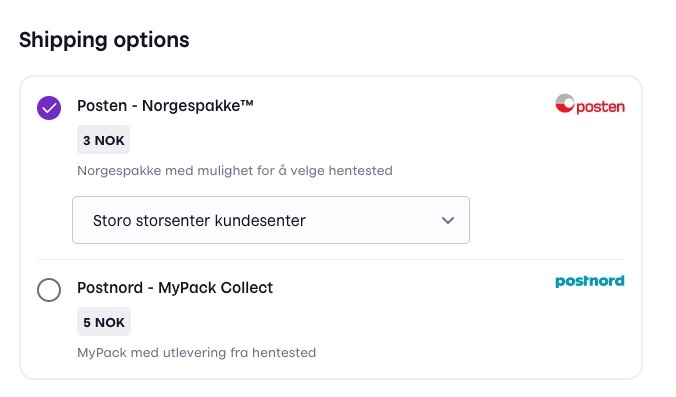
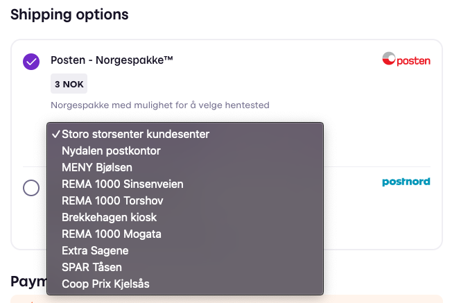
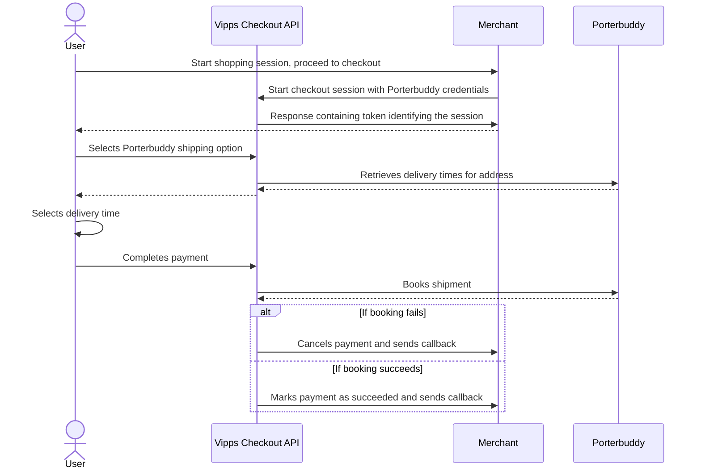
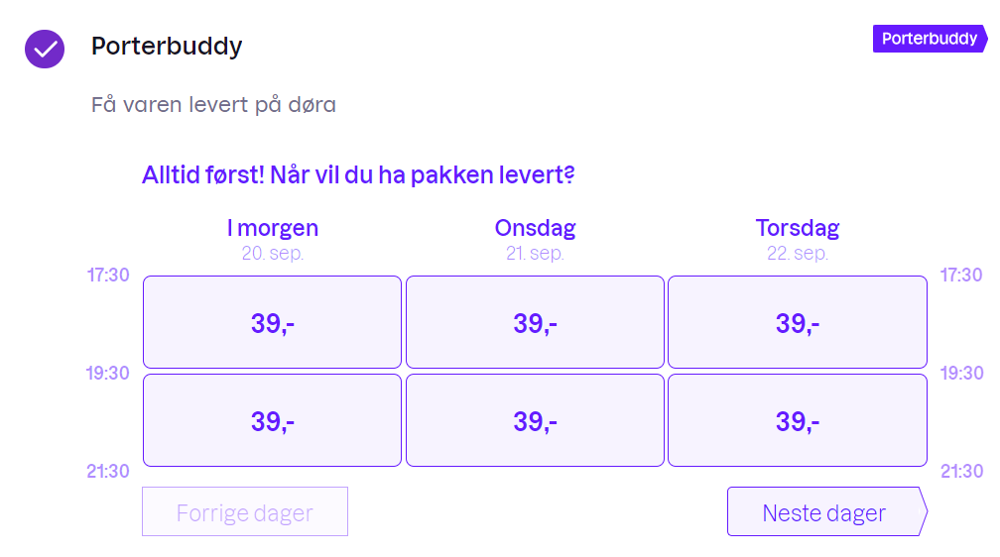
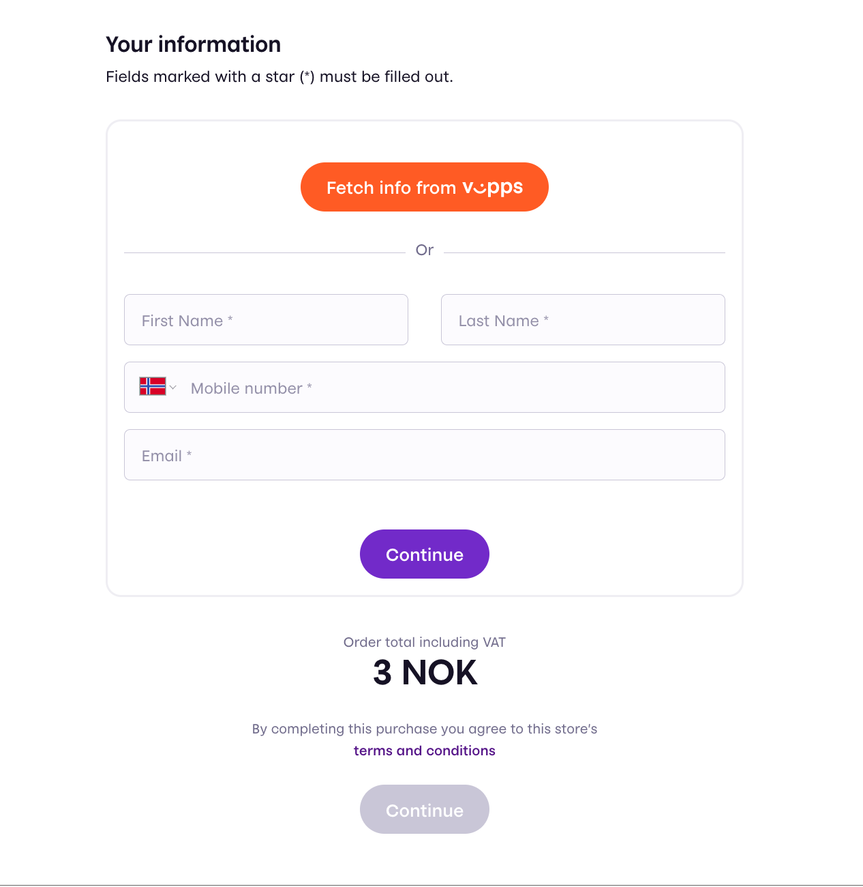
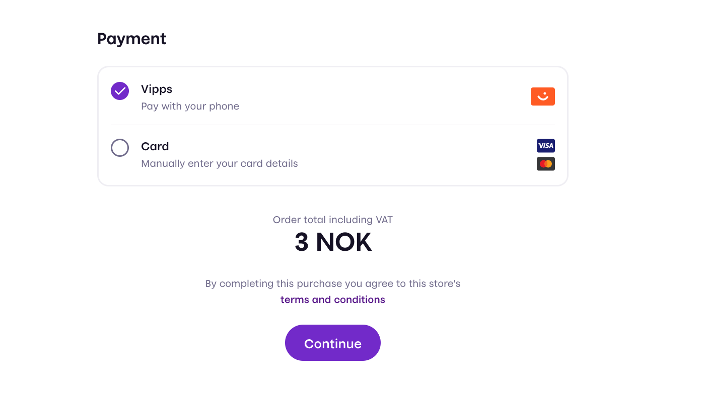
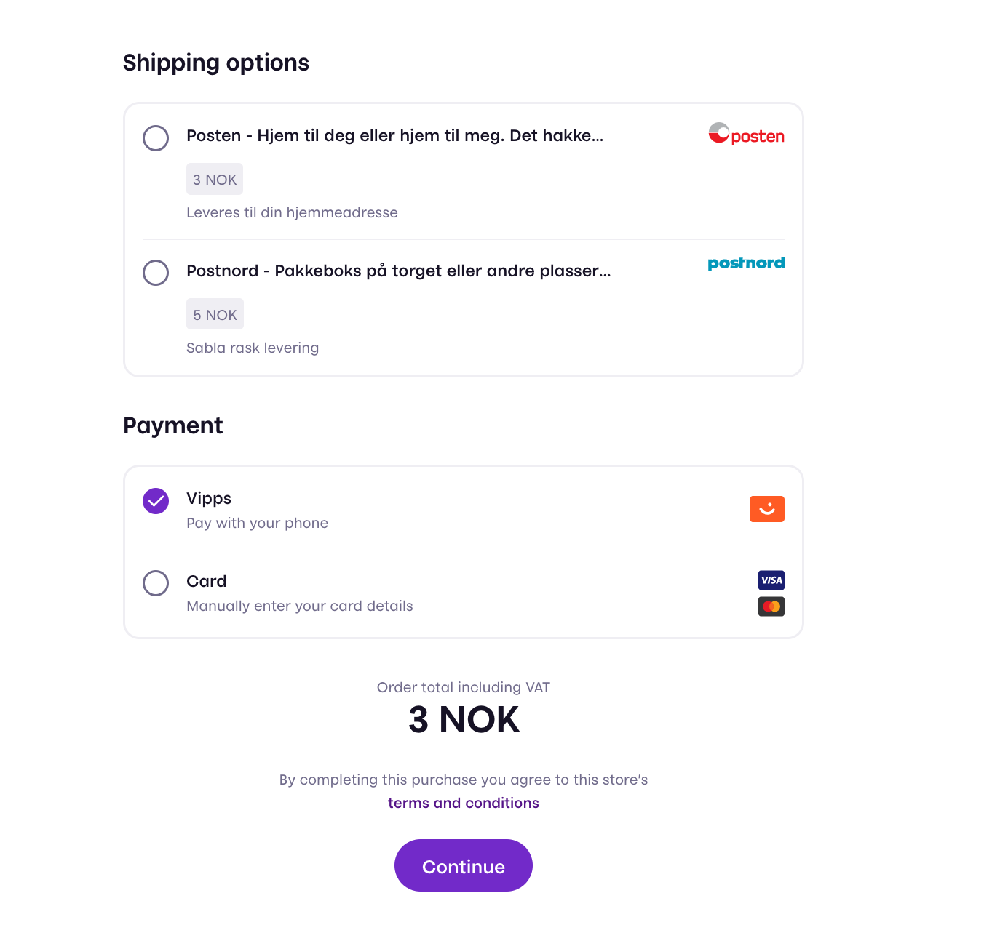
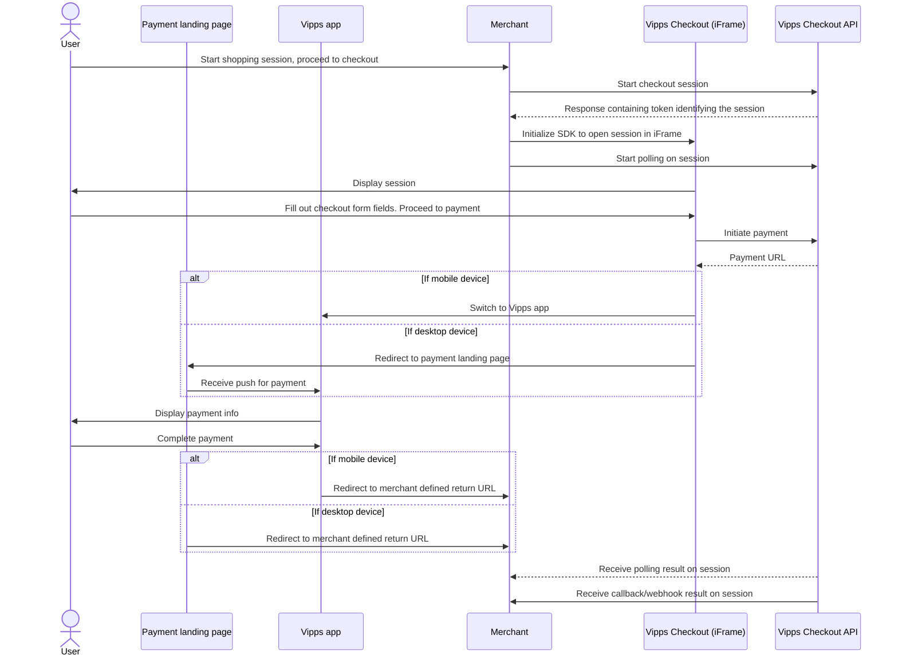

<!-- START_METADATA
---
title: API Guide
sidebar_position: 10
---
END_METADATA -->

# Vipps Checkout guide

Vipps Checkout provides an all-in-one solution for receiving payment for goods and services online using trusted Vipps technology and brand. It combines other Vipps products, Vipps Login and Vipps eCom/ePayments, allowing a frictionless integration for merchants.

API version: 2.0.0.

Document version: 1.1.1.

**Please note:** Always use the most recent API version when integrating with Vipps Checkout. All endpoints are described in detail in our [Swagger documentation](https://vippsas.github.io/vipps-developer-docs/api/checkout).

<!-- START_TOC -->

# Table of contents

- [Checkout Features](#checkout-features)
  - [Vipps Checkout API](#vipps-checkout-api)
  - [Vipps Checkout frontend](#vipps-checkout-frontend)
  - [SDK](#sdk)
  - [Shipping](#shipping)
    - [Static shipping](#static-shipping)
    - [Dynamic shipping](#dynamic-shipping)
    - [Pickup points](#pickup-points)
    - [Porterbuddy integration](#porterbuddy-integration)
  - [Vipps Checkout Elements](#vipps-checkout-elements)
    - [AddressFields false example](#addressfields-false-example)
    - [Addressfields and ContactFields false example](#addressfields-and-contactfields-false-example)
    - [Combination with shipping](#combination-with-shipping)
  - [Remembering of customer data](#remembering-of-customer-data)
- [System integration guidelines](#system-integration-guidelines)
  - [Flow diagram](#flow-diagram)
  - [Step 1: Initiating a session](#step-1-initiating-a-session)
    - [Configuration for use inside a native mobile application](#configuration-for-use-inside-a-native-mobile-application)
  - [Step 2: Displaying the session to the user](#step-2-displaying-the-session)
    - [Sticky checkout session](#sticky-checkout-session)
    - [SDK events](#sdk-events)
  - [Step 3: Handling the result of the session](#step-3-handling-the-result-of-the-session)
    - [Callback handling](#callback-handling)
    - [Session polling](#session-polling)
    - [Determine status of payment](#determine-status-of-payment)
    - [Step 3a: If a transaction is authorized, capture payment](#step-3a-if-a-transaction-is-authorized-capture-payment)
- [Integration partner and plugin guidelines](#integration-partner-and-plugin-guidelines)
  - [Partner signup API guidelines](#partner-signup-api-guidelines)
- [Transaction operations (Capture, Cancel, Refund, Details)](#transaction-operations-capture-cancel-refund-details)
- [Vipps side Transaction information](#vipps-side-transaction-information)
  - [Recommended integration (currently in pilot mode)](#recommended-integration-currently-in-pilot-mode)

<!-- END_TOC -->

# Checkout Features

Explains the high level features of Vipps Checkout.

## Vipps Checkout API

Vipps Checkout works around the concept of a _session_, which has a time to live of one hour. The API exposes endpoints for the merchant to interact with a session. These include:

- session initiation
- session status
- session cancellation

## Vipps Checkout frontend

Once a session is created, it is to be opened inside an iFrame embedded on the merchant website. The iFrame loads a web application that fetches all necessary information about the session from Vipps.

### SDK

Vipps provides an SDK to make opening the session on the merchant easy. It is highly recommended to use this.

## Shipping

In most situations a merchant wants to send goods to a customer using a shipping provider. Vipps Checkout supports two different types of shipping configurations:

### Static shipping

The merchant defines a set of static shipping options that _are not_ dependant on the address of the customer. This means that the merchant has to find a reasonable price for each shipping option, taking into account that the final cost of that shipment might be either more or less than the requested amount.

### Dynamic shipping

The merchant defines a _dynamic options callback URL_, which is called by Vipps Checkout every time a customer updates their address. The callback endpoint receives the updated address, and the merchant decides on a set of shipping options to display to the user.

### Pickup points

We currently provide support for Posten/Bring and PostNord pickup points. As of now, lockers etc. are not supported.
To enable pickup points for a logistics option, the isPickupPoint flag must be set to true.

The user selects the pickup point after picking their logistics option. The logistics option must have the isPickupPoint field set to true for this to appear.
We then return carrier's pickup point ID, pickup point name and address.




### Porterbuddy integration

Porterbuddy is a shipping provider that offers home delivery to a time slot selected by the customer. To enable it, the merchant must:

1. Provide Porterbuddy credentials in the logistics.integrations.porterbuddy object in session initiation.
2. Provide a logistics option with "IsPorterbuddy" flag set to true. The amount.value of the logistics option must also be set to zero as the price is determined dynamically based on delivery window.





## Vipps Checkout Elements

With Vipps Checkout Elements, you can adjust the fields and values present in the Checkout. For example, you might have a purchasing flow where you do not require an address because you are not sending physical goods, or you do not need the customer to identify themself because they are already logged into your system.

The data collected can be adjusted according to your needs with the fields `addressFields` and `contactFields` in the session initiation request.

These fields are by default set to `true` and, if not specified, will return the full address and contact details in the Checkout session.

### AddressFields false example

If you do not need the address from a user you can disable it, resulting in the following personal details form.



And the following payment form


### Addressfields and ContactFields false example

If you do not need the contact details for a customer you can disable it, resulting in the following session



### Combination with shipping

These options may be combined with shipping if it fits your scenario. For example resulting in the following session:



## Remembering of customer data

Vipps Checkout supports easy fetching of user info with the built-in Vipps Login integration. With a functionality called "Remember Me", the user is can opt in to having this information being persisted across different Vipps Checkout sessions on the same machine.

# System integration guidelines

Be sure to always use the most updated version of the API when integrating.

See also: [quick start guide](vipps-checkout-api-quick-start.md).

## Flow diagram

The standard flow for a Vipps Checkout consists of

1. Initiating a session
2. Displaying the session to the user
3. Handling the result of the session



## Step 1: Initiating a session

The merchant backend calls the [session initiation endpoint](https://vippsas.github.io/vipps-developer-docs/api/checkout#tag/Session/paths/~1v2~1session/post)

```http
POST: https://api.vipps.no/checkout/v2/session
```

with headers

| Header                        | Description                                                                                   | Example value       |
| ----------------------------- | --------------------------------------------------------------------------------------------- | ------------------- |
| `Merchant-Serial-Number`      | Vipps assigned unique number for a merchant. Found in [Vipps portal](https://portal.vipps.no) |                     |
| `Client_Id`                   | Client Id. Found in [Vipps portal](https://portal.vipps.no)                                   |
| `Client_Secret`               | Client Secret. Found in [Vipps portal](https://portal.vipps.no)                               |
| `Ocp-Apim-Subscription-Key`   | Subscription key. Found in [Vipps portal](https://portal.vipps.no)                            |
| `Vipps-System-Name`           | The name of the ecommerce solution                                                            | `woocommerce`       |
| `Vipps-System-Version`        | The version number of the ecommerce solution                                                  | `5.4`               |
| `Vipps-System-Plugin-Name`    | The name of the ecommerce plugin                                                              | `vipps-woocommerce` |
| `Vipps-System-Plugin-Version` | The version number of the ecommerce plugin                                                    | `1.4.1`             |

The last four headers (starting with `Vipps-System-`) are meant to identify your system (and plugin). Please use self-explanatory, human readable and reasonably short values.

All fields of the request body are described in our [API Reference](https://vippsas.github.io/vipps-developer-docs/api/checkout#tag/Session/paths/~1v2~1session/post).

**Please note:** When using dynamic shipping we recommend that you define `logistics.fixedOptions` as a backup. If the callback does not resolve successfully within 8 seconds, returns `null` or an empty list the system will fall back to static options. If no fallback options are provided, the user will be presented with an error and will not be able to continue with the checkout.

The response object consists of a `token` and a `checkoutFrontendUrl`, which are used in the next step

### Configuration for use inside a native mobile application

Vipps Checkout can be used in an iOS or Android app to pay for goods and services. The Vipps Checkout frontend may then be opened directly inside a Webview, instead of as an iFrame inside a merchant website.

In this situation the merchant may wish to have a `returnUrl` to direct the user back to an application using a custom URL scheme (e.g. `myapp://`) instead of https. The frontend application will automatically try to detect if the user is on a mobile device, if so doing an "app switch" into the Vipps application, and then back to your application upon completion. Because of variations in devices and browser implementations there are certain edge cases where the device type is wrongly detected. Initiate the session with `userFlow` set to `NATIVE_REDIRECT` to ensure that the app switching is done consistently after payment.

## Step 2: Displaying the session

Load the SDK in the `<head>` section of the merchant website.

```html
<head>
  <script src="https://checkout.vipps.no/vippsCheckoutSDK.js"></script>
</head>
```

The SDK exposes a global function called `VippsCheckout`. Initialize this with the following parameters

| Parameter             | Description                                                                                                       | Optional |
| --------------------- | ----------------------------------------------------------------------------------------------------------------- | -------- |
| `checkoutFrontendUrl` | Specifies where to load the iFrame content from. Comes from session creation response                             | No       |
| `iFrameContainerId`   | The id of the html element to contain the Checkout iFrame                                                         | No       |
| `token`               | Token identifying the session. Comes from session creation response.                                              | No       |
| `language`            | Can be set to 'no' Norwegian, or 'en' English. This is optional and will default to 'en' English if not specified | Yes      |
| `on`                  | Listen to events from Checkout. See [SDK events](#sdk-events) for more details.                                   | Yes      |

Example merchant website using Vipps Checkout SDK to embed an iFrame with the session in plain html/js.

**Please note:** To call the “create session endpoint” you must include headers that contain secret keys (client secret, subscription key). The javascript in the example can be openly viewed by anyone as it is client side frontend code. Therefore, you must call your own backend from the Javascript on the frontend, and then in that backend call the Checkout create session endpoint so you don’t leak the keys.

```html
<html>
  <head>
    <title>Merchant website</title>
    <script src="https://checkout.vipps.no/vippsCheckoutSDK.js"></script>
  </head>
  <body>
    <button type="button" id="checkout-button">Checkout with Vipps</button>
    <section id="vipps-checkout-frame-container">
      <!-- This is where the iFrame will be embedded -->
    </section>
    <script>
      document
        .getElementById("checkout-button")
        .addEventListener("click", function () {
          // Relay an initiate session request to Vipps Checkout API through the merchant's backend
          fetch("<MERCHANT BACKEND CREATE SESSION URL>", {
            method: "POST",
          })
            .then((response) => response.json())
            .then((data) => {
              var vippsCheckout = VippsCheckout({
                checkoutFrontendUrl: data.checkoutFrontendUrl,
                iFrameContainerId: "vipps-checkout-frame-container",
                language: "no",
                token: data.token,
              });
            })
            .catch((error) => {
              // Handle at least these two types of errors here:
              // 1. Fetch to create session endpoint failed
              // 2. VippsCheckout SDK not loaded resulting in VippsCheckout not being defined
            });
        });
    </script>
  </body>
</html>
```

**Please note:** The Vipps Checkout frontend **is not** supposed to be open in its own browser window/tab. The only exception to this is when using Vipps Checkout inside a Webview in a native mobile application.

### Sticky checkout session

The SDK provides an alternative way to display the session, using a query parameter in the URL. This makes the session "sticky", meaning that the same session will open after a page refresh.

If the query parameter `token` is present, and the token attribute in the argument object to VippsCheckout **is not** defined, the SDK will load the iFrame with the token from the query parameter.

We provide a helper method that, when called, will redirect to the current page with the `token` queryParameter added to the URL. Initialize the `VippsCheckout` function outside of initiating a session.

**Please note:** Make sure to initialize `VippsCheckout` outside of any user dependant execution blocks (like event handlers) to make sure that the iFrame is loaded every time a user lands on the page.

```js
// Globally defined
var vippsCheckout = VippsCheckout({
  checkoutFrontendUrl: data.checkoutFrontendUrl,
  iFrameContainerId: 'checkout-iframe-container',
});

// Create session fetch function
.then((data) => {
  vippsCheckout.redirectToCurrentPageWithToken(data.token)
})
```

### SDK events

You can listen to changes in Checkout by supplying callbacks to the `on` option in the SDK.
Each key in the map supplied to `on` corresponds to an event and accepts a call callback-function with a `data` parameter as a value.

Available events:

| Parameter                      | Description                                                                                             | Type                                                                                                                                            |
| ------------------------------ | ------------------------------------------------------------------------------------------------------- | ----------------------------------------------------------------------------------------------------------------------------------------------- |
| `shipping_option_selected`     | Is triggered when the user selects a shipping option or `undefined` when shipping option is deselected. | `ShippingOption` &#124; `undefined`                                                                                                             |
| `total_amount_changed`         | Is triggered when the total amount changes (for example when a shipping option is selected).            | `Money`                                                                                                                                         |
| `session_status_changed`       | Is triggered when on changes in session status (for example when payment is started).                   | "SessionStarted" &#124; "PaymentInitiated" &#124; "PaymentSuccessful" &#124; "PaymentFailed" &#124; "SessionTerminated" &#124; "SessionExpired" |
| `shipping_address_changed`     | Is triggered when a new "delivered to" address is submitted or `undefined` when removed.                | `Address` &#124; `undefined`                                                                                                                    |
| `customer_information_changed` | Is triggered when new customer information is submitted or `undefined` when removed.                    | `Address` &#124; `undefined`                                                                                                                    |

#### Types

##### ShippingOption

| Parameter     | Type                             | Description                                                                 |
| ------------- | -------------------------------- | --------------------------------------------------------------------------- |
| `brand`       | `string`                         | The name of the brand of the option (for example "Posten" or "PostNord").   |
| `description` | `description` &#124; `undefined` | The description of the shipping option.                                     |
| `product`     | `string`                         | The brand specific product (for example "Servicepakke" or "Home delivery"). |
| `price`       | `Money`                          | The price of the shipping option.                                           |

##### Money

| Parameter                | Type     | Description                                                                                                 |
| ------------------------ | -------- | ----------------------------------------------------------------------------------------------------------- |
| `fractionalDenomination` | `number` | Value of in minor units. For Norwegian kroner (NOK) that means 1 kr = 100 øre. Example: 499 kr = 49900 øre. |
| `currency`               | `string` | Three letter ISO-4217 currency code.                                                                        |

##### Address

| Parameter   | Type     |
| ----------- | -------- |
| `address`   | `string` |
| `city`      | `string` |
| `country`   | `string` |
| `email`     | `string` |
| `firstName` | `string` |
| `lastName`  | `string` |
| `phone`     | `string` |
| `zip`       | `string` |

#### Example

```js
window.VippsCheckout = {
  checkoutFrontendUrl: data.checkoutFrontendUrl,
  iFrameContainerId: "vipps-checkout-frame-container",
  language: "no",
  token: data.token,
  on: {
    shipping_option_selected: function (data) {
      // Do something when the shipping option is selected
    },
    total_amount_changed: function (data) {
      // Do something when the total amount changed
    },
    session_status_changed: function (data) {
      // Do something when status changed
    },
    shipping_address_changed: function (data) {
      // Do something when shipping address changed
    },
    customer_information_changed: function (data) {
      // Do something when customer information changed
    },
  },
};
```

## Step 3: Handling the result of the session

After the user has completed the checkout process the merchant will be notified with transaction details through a _callback_ and _polling_

**Please note:** It is highly recommended to implement polling in addition to callback. Vipps **does not** guarantee delivery of the callback.

### Callback Handling

The callback will be sent to a [callback endpoint (click on the "Callbacks" tab)](https://vippsas.github.io/vipps-developer-docs/api/checkout#tag/Session/paths/~1v2~1session/post) implemented by the merchant

```http
POST: {callbackPrefix}/checkout/{apiVersion}/order/{orderId}
```

where `callbackPrefix` and `orderId` (also referred to as `transaction.reference`) are defined when initiating a session. `callbackAuthorizationToken` provided by the merchant at session initiation will be attached as the `Authorization` header. Use this to authorize the caller.

Vipps demands that every callback is responded to with a `HTTP 202 response`. In the eventuality that any other response is sent, Vipps will retry with an exponential back off until 202 is received again. During this exponential back off, Vipps will pause any new notifications until a 202 is returned on the original callback. It is critical that the endpoint receiving the callback is robust. It should also be able to receive any additional data not specified in the minimum example so that it can be backwards compatible in accordance with our integration guidelines.

### Session polling

Vipps Checkout will expose a polling endpoint as described in our [Swagger](https://vippsas.github.io/vipps-developer-docs/api/checkout#tag/Session/paths/~1v2~1session~1%7BsessionId%7D/get). The complete URL for polling is returned from the [session creation endpoint](https://vippsas.github.io/vipps-developer-docs/api/checkout#tag/Session/paths/~1v2~1session/post) as `pollingUrl`.

### Determine status of payment

The status of the Payment can be either `CREATED, AUTHORISED, TERMINATED`, and can be found inside the `PaymentDetails` object in both the callback or session polling response. Note that a callback will never be in the `CREATED` state, as it is only sent after a payment is completed in an end state. For example when a customer successfully pays, the `PaymentDetails.state` is `AUTHORISED`. If the payment is initiated and ongoing, it will be `CREATED`. If the payment was either aborted, expired or an error occurred, the state is `TERMINATED`. Please refer to the [Swagger schema](https://vippsas.github.io/vipps-developer-docs/api/checkout#tag/Session/paths/~1v2~1session~1%7BsessionId%7D/get) for `CallbackSessionDetails` and `GetSessionResponse` to see the whole context.

If you want more granular information about the payment, you can call the [underlying API](https://vippsas.github.io/vipps-epayment-api/index.html#tag/QueryPayments/operation/getPayment) that Vipps Checkout itself uses.

## Step 3a: If a transaction is authorized, capture payment

If the payment state of a session received in callback, or when polling, is `AUTHORISED`, the amount of the transaction was successfully _reserved_. In order to actually move the money and complete the payment, the transaction must be _captured_. Capture must be done in accordance with your terms and conditions with the user. Our recommendation is that this is not performed until the goods or services have been delivered.

A capture operation for the whole amount reserved is called a "full capture". A "partial capture" is a capture operation on only parts of the amount reserved and is e.g. used if only parts of an order could be fulfilled. Captures cannot be made on an amount larger than the reservation.

Full and partial Capture [`POST:epayment/v1/{reference}/capture`](https://vippsas.github.io/vipps-epayment-api/index.html#operation/capturePayment)

**Please note:** A reservation will expire automatically after some days if it is not captured, but it can also be manually removed using the `Cancel` transaction operation. If a transaction is already captured, the `Refund` operation must be used. This is because money has actually been moved at this point and must be moved back. See [Transaction operations](vipps-checkout-api.md#transaction-operations-capture-cancel-refund-details) for more information.

# Integration partner and plugin guidelines

Vipps Checkout supports [partner-key-based authentication](https://github.com/vippsas/vipps-ecom-api/blob/master/vipps-ecom-api.md#partner-keys).

In the initiation request, use your own credentials and send the Merchant Serial Number as described. This results in an on-behalf-of authentication if the merchant has a valid connection to your solution.

## Partner signup API guidelines

If you are using the [SignupAPI](https://github.com/vippsas/vipps-signup-api), you need to use the "Ecom access" key instead of the default access token in the API calls. This API is considered deprecated by Vipps and should be migrated away from.

# Transaction operations (Capture, Cancel, Refund, Details)

Vipps Checkout should be considered an extension of existing other Vipps commerce functionality. This means that transaction operations other than payment initiation, which is handled by Checkout (see [Checkout Checklist](vipps-checkout-api-checklist.md)), should be done on the ePayment API described [in their official docs](https://github.com/vippsas/vipps-epayment-api). A guideline for the integration can be found [here](https://github.com/vippsas/vipps-epayment-api/blob/main/docs/api/Getting-Started.md#getting-started-with-the-vipps-merchant-payments-api). You should use the same credentials as the ones you use with Checkout.

**Please note:** That the eCom API should not be used as it lacks full support for Card transactions.

**Please note:** Vipps Checkout only supports "Reserve-Capture". If you are on a "Direct-Capture" setup, please seek assistance in accordance with the [guidelines](https://github.com/vippsas/vipps-developers/blob/master/contact.md).

# Vipps side Transaction information

You might want to find the Vipps `transactionId` value of a transaction. This can be used, for example, to utilize [Vipps-assisted content monitoring](https://github.com/vippsas/vipps-order-management-api/blob/main/vipps-order-management-api.md#vipps-assisted-content-monitoring) or to support account procedures.

## Recommended integration (currently in pilot mode)

In order to integrate with the receipts functionality, you need to retrieve the pspreference in the "paymentAction": "AUTHORISATION" event from the [eventlog](https://vippsas.github.io/vipps-epayment-api/index.html#operation/getPaymentEventLog) endpoint. This is required when utilizing receipts with Vipps Checkout or Free standing card payments
