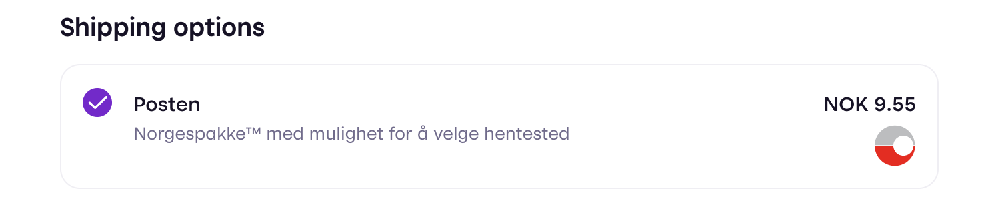
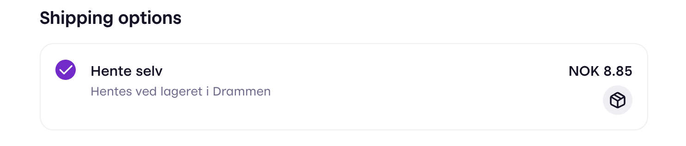
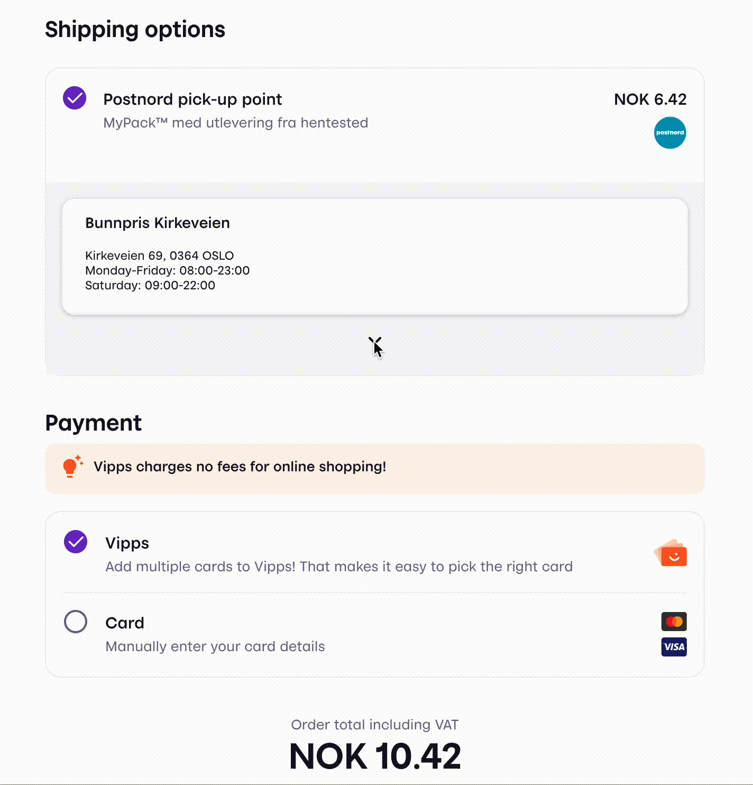
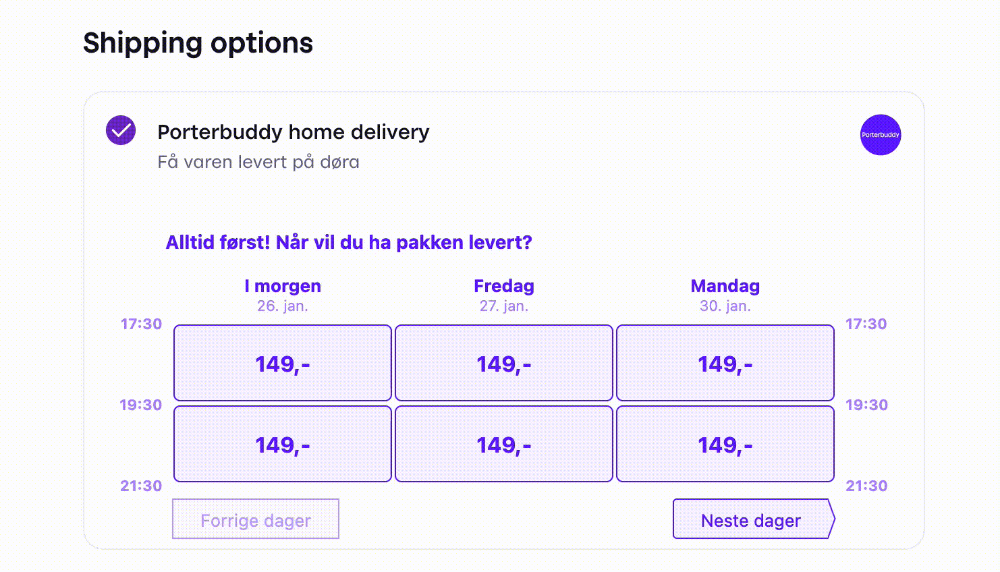

## <!-- START_METADATA

title: "How it works: Shipping"
sidebar_position: 11

---

END_METADATA -->

# How it works for shipping

Checkout supports all major shipping providers in the Norwegian market, including:

- Bring/Posten
- Postnord
- Porterbuddy
- Helthjem
- Instabox

To see how this works, [visit our demo store](https://demo.vipps.no/vipps-checkout-1/full).

A provider is chosen by setting the `brand` property to one of the allowed string values. Consult the [API spec](https://vippsas.github.io/vipps-developer-docs/api/checkout#tag/Session/paths/~1session/post) for further details. This will set the logo and name of the provider.

If none of the providers fit your use case (e.g., indicating in-store-pickup), set the `brand` to "OTHER" for generic shipping. This will set a generic icon.

## Enriching features

For some of the providers we offer enriching features, including:

- Pickup point
- Home delivery

These features change the user interface to allow for more specific selection of delivery time or place, where some of the features require you (the merchant) to provide credentials. Credentials are provided in the `logistics.integrations` property at session initiation and are used to perform a "pre booking" (i.e. reserve a time slot) for some of the shipping providers.

An enriching feature can be chosen by setting the `type` property on the logistics option.
Refer to the [API spec](https://vippsas.github.io/vipps-developer-docs/api/checkout#tag/Session/paths/~1session/post) to see which features are available for each shipping provider.

### Pickup point

The _pickup point_ feature is enabled by setting `type: "PICKUP_POINT"`. The title will become `{providerName} pick-up point` (e.g. "Posten pick-up point").
The consumer will choose an available pickup point, based on the address. Vipps will relay the selected option as part of the content in the "session completed callback".

### Home delivery

The _home delivery_ feature is enabled by setting `type: "HOME_DELIVERY"`. The title will become `{providerName} home delivery` (e.g. "Porterbuddy home delivery"), by default.
The consumer will choose an available delivery window, based on the address. Vipps relays the selected option as part of the content in the "session completed callback".

## When to provide shipping options

Shipping options can be provided by the merchant either at session initiation or at a later stage.

If you want to charge a flat rate for shipping you pass shipping options to the `logistics.fixedOptions` property at session initiation.

If you want to dynamically determine the price of a shipping option based on the address of the customer you need to have an endpoint for receiving callbacks. Pass the url to the `logistics.dynamicOptionsCallback` property. Checkout will call the endpoint with the address of the customer whenever they submit or update their address during a checkout session. The endpoint must return shipping options on the same format as for fixedOptions.

**Please note:** When using dynamic shipping we recommend that you define `logistics.fixedOptions` as a backup. If the callback does not resolve successfully within 8 seconds, returns `null` or an empty list the system will fall back to static options. If no fallback options are provided, the user will be presented with an error and will not be able to continue with the checkout.
