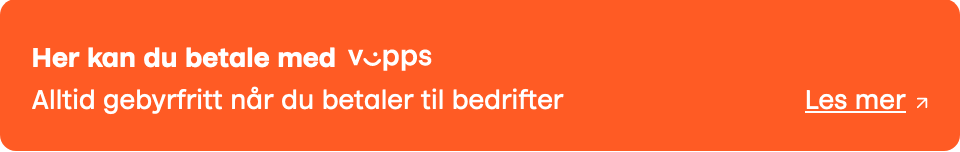
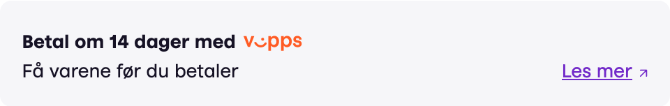
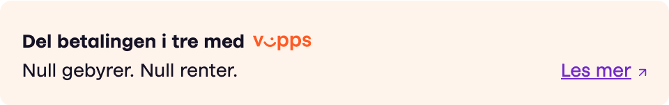
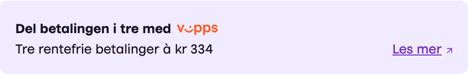

# Vipps On-Site Messaging

Vipps On-Site Messaging contains a set of badges that can be used to let your customers know that Vipps payment is accepted.

To be able to use the badges on your site you need to add the Vipps On-Site Messaging JavaScript library.
The library should preferable be added between your page's `<head>...</head>`-tags and only once per page:

```html
<script async type="text/javascript" src="https://checkout.vipps.no/on-site-messaging/v1/vipps-osm.js"></script>
```

If you don't have access to edit your websites code directly you can also place the JavaScript library just before the chosen badge.

## Badges

The On-Site Messaging library contains four badges with different tailored message.
Each badge also comes in four variants in different color-pallets to suite your website.

Example of all the variants can be found [here](https://checkout.vipps.no/on-site-messaging/v1).

### Vipps Payment

#### Example



```html
<vipps-payment-badge variant="orange"></vipps-payment-badge>
```

#### Attributes

| Attribute | Description                                                                                        | Default  |
|:----------|:---------------------------------------------------------------------------------------------------|:---------|
| variant   | The color variant of the badge. Accepted values:<br/>`orange`, `gray`, `light-orange`, or `purple` | `orange` |


### Pay later

#### Example



```html
<vipps-pay-later-badge variant="gray"></vipps-pay-later-badge>
```

#### Attributes

| Attribute | Description                                                                                        | Default  |
|:----------|:---------------------------------------------------------------------------------------------------|:---------|
| variant   | The color variant of the badge. Accepted values:<br/>`orange`, `gray`, `light-orange`, or `purple` | `orange` |

### Zero fees

#### Example



```html
<vipps-zero-fees-badge variant="purple"></vipps-zero-fees-badge>
```

#### Attributes

| Attribute | Description                                                                                        | Default  |
|:----------|:---------------------------------------------------------------------------------------------------|:---------|
| variant   | The color variant of the badge. Accepted values:<br/>`orange`, `gray`, `light-orange`, or `purple` | `orange` |

### Split payment

#### Example



```html
<vipps-split-payment-badge variant="purple" amount="1000"></vipps-split-payment-badge>
```

#### Attributes

| Attribute | Description                                                                                                                                                          | Default  |
|:----------|:---------------------------------------------------------------------------------------------------------------------------------------------------------------------|:---------|
| variant   | The color variant of the badge. Accepted values:<br/>`orange`, `gray`, `light-orange`, or `purple`                                                                   | `orange` |
| amount    | The total payable amount in NOK.<br/>The amount should be a number without any currency symbol or code.<br/>Either period or comma is accepted as decimal separator. |          |
